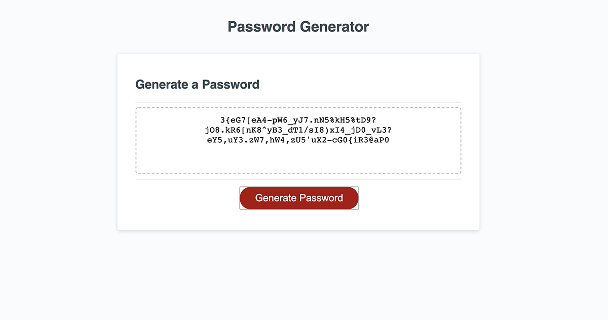

# Password Generator
## by Aaron Rosenblatt
#### I modified a starter JavaScript code to create an application that generates a random password. The app runs in a browser and includes HTML and CSS powered by JavaScript code. The user can select a range between 8 and 128 characters. The user can also select whether numbers, lower case letters, upper case letters and/or special characters can be used in the password. After selecting the number of characters and criteria, the password will be displayed on the page.  

### The GitHub repository for the password generator can be viewed here: https://github.com/noplur/password-generator
### The link to the website of the password generator can be viewed here: https://noplur.github.io/password-generator/

### Here is a screenshot of the password generator:
### 